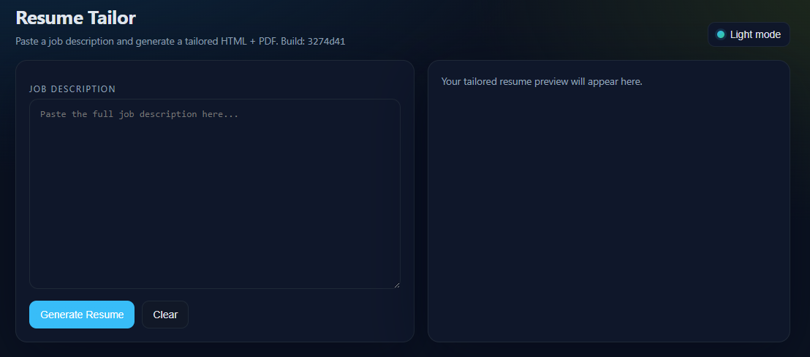

# Job Application Assistant

AI-powered resume and cover letter tailoring tool that generates job-specific PDF/HTML outputs from a pasted job description.

## Features

- Web UI (`Flask`) for pasting a job description and generating tailored documents
- Job-fit assessment with recommendation (`APPLY`, `MAYBE`, `NO`) and gap breakdown
- Resume generation from `assets/resume.json` + `assets/template.html`
- Cover letter generation with HTML preview (or text fallback)
- CLI support for resume generation
- Deterministic role-aware strategy engine (software vs cybersecurity emphasis)
- Strict hallucination guards:
  - no new bullets
  - no new technologies
  - no cloud-provider substitution (for example `Firebase -> AWS`)
- Optional AI "light rephrase" layer with hard validation and deterministic fallback

## Project Structure

- `web_app.py` - Flask web app (default port `5055`)
- `tools/resume_bot.py` - classification, strategy selection, deterministic ranking, validation, rendering
- `assets/resume.json` - canonical resume data source
- `assets/template.html` - base visual template/style
- `outputs/` - generated files (created automatically)

## Requirements

- Python 3.10+
- `pip`
- Playwright Chromium (for PDF rendering)

Install dependencies:

```powershell
python -m pip install flask openai anthropic playwright
python -m playwright install chromium
```

## Run the Web App

```powershell
python web_app.py
```

Open:

- `http://localhost:5055`

## Screenshot



## Environment Variables

- `RESUME_JSON` - path to source resume JSON  
  Default: `assets/resume.json`
- `RESUME_TEMPLATE` - path to HTML template  
  Default: `assets/template.html`
- `RESUME_OUTPUT_DIR` - output directory  
  Default: OS temp folder (`<temp>/job-application-assistant`)
- `RESUME_MAX_PAGES` - max pages for AI-tailored resume PDF  
  Default: `2`
- `OPENAI_API_KEY` - enables AI tailoring, fit assessment, and AI cover letters via OpenAI
- `OPENAI_MODEL` - optional model name override used by OpenAI calls
- `ANTHROPIC_API_KEY` - enables AI tailoring, fit assessment, and AI cover letters via Anthropic
- `ANTHROPIC_MODEL` - optional model name override used by Anthropic calls
- `AI_PROVIDER` - optional provider override (`openai` or `anthropic`); otherwise auto-selects based on available keys
- `APP_VERSION` - optional build/version label shown in UI

## CLI Usage

Generate a tailored resume from files:

```powershell
python tools/resume_bot.py --resume assets/resume.json --template assets/template.html --job job.txt --out-dir outputs
```

Arguments:

- `--resume` (required): path to resume `.json`
- `--template` (required): path to template `.html`
- `--job` (optional): path to job description text file
- `--out-dir` (optional): output folder
- `--label` (optional): filename label

## Development Smoke Test

Run quick regression checks (strategy order, bullet safety, link formatting):

```powershell
python tools/dev_smoke_test.py
```

## Output Files

Generated in `outputs/` with timestamped names:

- `Resume_<Label>_<Timestamp>.html`
- `Resume_<Label>_<Timestamp>.pdf`
- `CoverLetter_<Label>_<Timestamp>.html` (or `.txt` fallback)
- `CoverLetter_<Label>_<Timestamp>.pdf` (when HTML render succeeds)

## Notes

- Without `OPENAI_API_KEY` and `ANTHROPIC_API_KEY`, the app still works with deterministic classification, ranking, and rendering.
- `assets/resume.json` is the single source of truth for resume facts.
- PDF export depends on Playwright Chromium being installed.

## Why I Built This

Built as a personal productivity tool to automate the most tedious part of job hunting: tailoring a resume for every application. Deployed on a private cloud VM with VPN-only access via Tailscale.

## Auto Deploy (GitHub -> VM)

This repo includes `.github/workflows/deploy-vm.yml` to auto-deploy on every push to `main`.

Required GitHub repository secret:

- `VM_SSH_KEY` - private SSH key content (PEM) used to access the VM

Notes:

- Configure workflow connection values via repository variables:
  - host: `<your-vm-ip>` (`VM_HOST`)
  - user: `<your-vm-user>` (`VM_USER`)
  - port: `22`
- `VM_SSH_KEY` must be added under **Settings -> Secrets and variables -> Actions -> Repository secrets**.
- If you put the key under Repository variables, deploy will fail.

Deployment behavior:

- Connects to VM over SSH
- Runs `git fetch`, `git checkout main`, `git reset --hard origin/main`
- Restarts `resume-tailor` service

Verify workflow success:

- GitHub `Actions` -> `Deploy to Lightsail VM` -> latest run is green
- Open app and confirm `Build: <commit>` matches the latest pushed commit

## Security

This repo includes `.github/workflows/security.yml`, a CI security pipeline that runs on every push and pull request to `main` (also configured for `master`).

Pipeline coverage:

- `Bandit`: Python SAST for insecure coding patterns in source code.
- `Semgrep`: broader static analysis for Python issues, secrets exposure patterns, and OWASP-style risks.
- `Gitleaks`: git-history and code scanning for leaked credentials/secrets.
- `pip-audit`: dependency vulnerability scanning against known advisories from `requirements.txt`.

Enforcement behavior:

- Reports are uploaded as workflow artifacts and summarized in the GitHub Actions run summary.
- A policy job runs after scanning and fails the workflow when `Bandit` reports any `HIGH` severity findings.
- The policy job also fails when vulnerable dependencies are detected by `pip-audit`, blocking merge until remediated.
